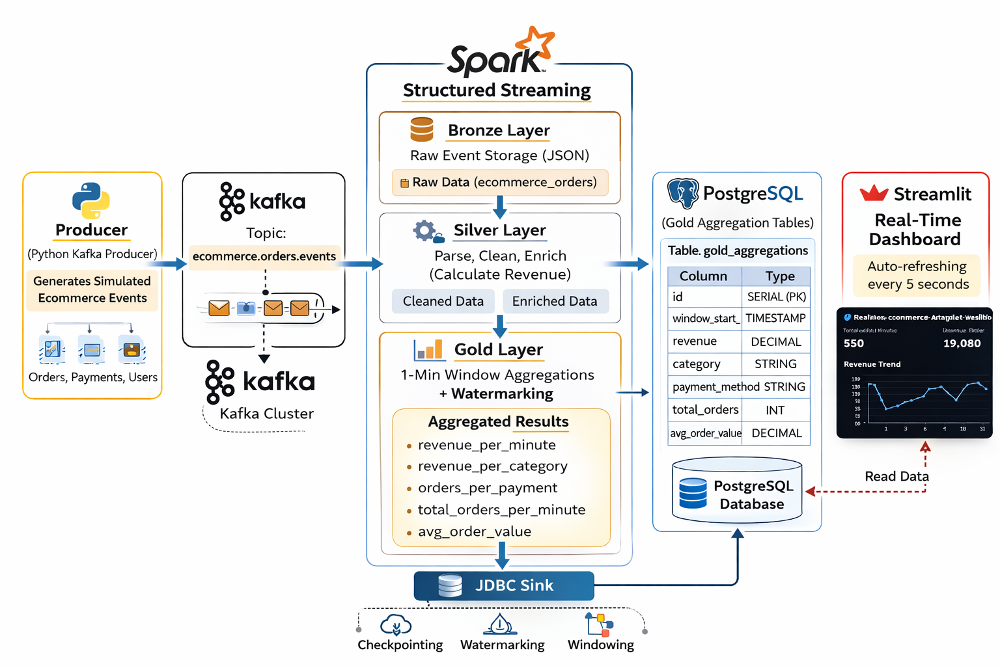
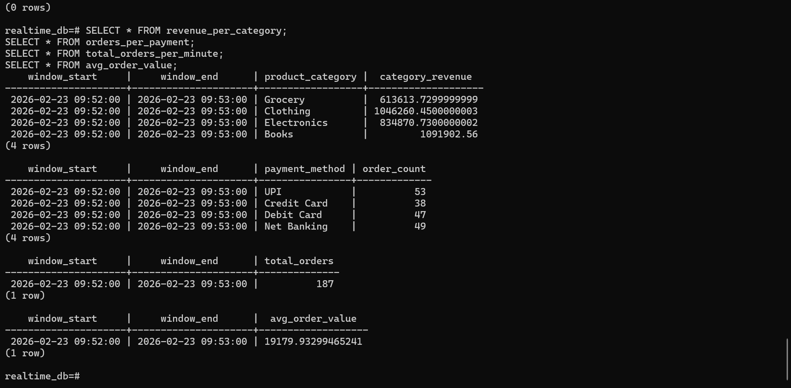

🚀 Real-Time Ecommerce Analytics Platform
```
An end-to-end real-time data engineering pipeline built using Kafka, Spark Structured Streaming, PostgreSQL, and Streamlit.

This project simulates ecommerce order events and processes them in real time to generate live business analytics dashboards.

🏗️ Architecture Overview
Producer → Kafka → Spark Structured Streaming
        → Bronze Layer (Raw JSON Storage)
        → Silver Layer (Cleaned & Enriched Data)
        → Gold Layer (1-Min Window Aggregations + Watermarking)
        → PostgreSQL (Gold Tables)
        → Streamlit Live Dashboard
```
📐 Architecture Diagram


```
⚙️ Tech Stack
Apache Kafka (Event Streaming)
Apache Spark Structured Streaming
PostgreSQL (Analytical Storage)
Streamlit (Live Dashboard)
Docker (Containerization)
Python (PySpark, Kafka Producer)

📊 Real-Time Metrics Generated

The system computes live analytics using 1-minute tumbling windows with watermarking:
Revenue per minute
Revenue per product category
Orders per payment method
Total orders per minute
Average order value
All metrics are written to PostgreSQL and visualized in real time.

🥉 Bronze Layer

Raw JSON event storage
Preserves original streaming data
Ensures traceability and replay capability

🥈 Silver Layer

Parses Kafka JSON events
Converts event timestamps
Calculates revenue (price × quantity)
Filters invalid/null records

🥇 Gold Layer

1-minute window-based aggregations
Watermark handling for late events
Writes aggregated results to PostgreSQL via JDBC sink

Gold Tables:
revenue_per_minute
revenue_per_category
orders_per_payment
total_orders_per_minute
avg_order_value
```
🗄️ PostgreSQL Output:

```
📈 Live Dashboard
Features:
Auto-refresh every 5 seconds
Real-time revenue trend chart
Category breakdown
Payment method distribution
KPI metrics (Total Orders, Avg Order Value)

🚀 How to Run the Project
1️⃣ Start Infrastructure
docker-compose up -d
2️⃣ Run Spark Streaming Job
docker exec -it spark spark-submit \
--master local[*] \
--packages org.apache.spark:spark-sql-kafka-0-10_2.12:3.5.1,org.postgresql:postgresql:42.6.0 \
/opt/app/spark_stream.py
3️⃣ Start Kafka Producer
python producer/producer.py
4️⃣ Run Dashboard
streamlit run dashboard/dashboard.py


🎯 Key Concepts Demonstrated:
Real-time streaming architecture design
Structured Streaming with watermarking
Window-based aggregations
Streaming-to-PostgreSQL sink
Multi-layer data lake architecture (Bronze/Silver/Gold)
Live analytics dashboarding
End-to-end distributed data pipeline

🧠 Learning Outcomes:
Through this project, I gained hands-on experience in:
Designing scalable streaming systems
Handling late-arriving data with watermarking
Writing streaming aggregations to relational databases
Building production-style data engineering pipelines
Integrating real-time analytics with visualization tools


📁 Project Structure
realtime-ecommerce-analytics/
│
├── producer/
│ └── producer.py
│
├── spark/
│ └── spark_stream.py
│
├── dashboard/
│ └── dashboard.py
│
├── docker-compose.yml
├── requirements.txt
├── README.md
└── screenshots/
├── architecture.png
├── dashboard.png
└── postgres_data.png

👩‍💻 Author
Prachi Adhalage

```
